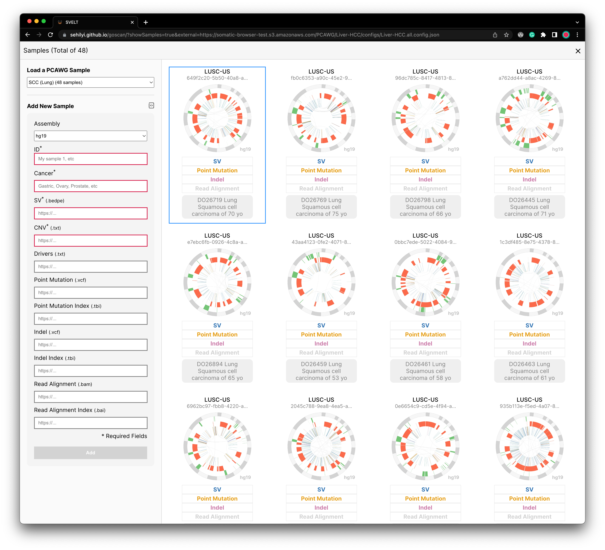

# Loading Data

There are two ways to load your data:

- [Loading a small number of samples directly on the browser through the interface.](#Loading-Data-Through-Interface)
- [Loading a large number of samples through data configurations](#data-configuration).

### Loading Data Through Interface

In the cohort-level view, there is a side panel that enables you to add a new sample by providing metadata (e.g., cancer type) and file URLs (e.g., bedpe, txt, vcf).

||
|---|

After providing all required information, you can click on the Add button on the bottom of this form. Once you click on it, you will be able to see a sample added as the first sample.

||
|---|

:::note help
To test the browser for adding a sample, you can use the following information:

|Fields|Contents|
|---|---|
|ID|7a921087-8e62-4a93-a757-fd8cdbe1eb8f
|Cancer|Ovarian
|assembly|"hg19"
|SV|`https://s3.amazonaws.com/gosling-lang.org/data/SV/7a921087-8e62-4a93-a757-fd8cdbe1eb8f.pcawg_consensus_1.6.161022.somatic.sv.bedpe`
|CNV|`https://s3.amazonaws.com/gosling-lang.org/data/SV/7a921087-8e62-4a93-a757-fd8cdbe1eb8f.consensus.20170119.somatic.cna.annotated.txt`
:::

Details about each of the fields, as well as accepted files, are described in [the following section](#Data-Configuration).

### Data Configuration

You need to (1) make a data config file (`.json`) that contains the information for individual samples, (2) store the config file in a HTTPS file server (e.g., AWS S3 or [GitHub Gist](https://gist.github.com/)), and (3) use it with [the `external` parameter of the Chromoscope URL](url-parameters.md):

```
// format
https://chromoscope.bio/?external=[URL_TO_YOUR_CONFIG_FILE]

// example
https://chromoscope.bio/?external=https://gist.githubusercontent.com/sehilyi/a9bbbc3e63806d2282e1959e27a65a53/raw/b6c0ab07a220027196746f46607e916bd9751c70/goscan-multiple-samples.json
```

For each sample, you need to prepare the following information in a JSON object.

| Property | Type | Note |
|---|---|---|
| `id` | `string` | Required. Unique ID. |
| `cancer` | `string` | Required. Type of a cancer. |
| `assembly` | `'hg38'` or `'hg19'` | Required. Assembly. |
| `sv` | `string` | Required. An URL of the SV bedpe file (`.bedpe`). |
| `cnv` | `string` | Required. An URL of the CNV text file (`.tsv`). |
| `drivers` | `string` | Optional. An URL of a file that contains drivers (`.tsv` or `.json`). |
| `vcf` | `string` | Optional. An URL of the point mutation file (`.vcf`). |
| `vcfIndex` | `string` | Optional. An URL of the point mutation index file (`.tbi`). |
| `vcf2` | `string` | Optional. An URL of the the indel file (`.vcf`). |
| `vcf2Index` | `string` | Optional. An URL of the indel index file (`.tbi`). |
| `bam` | `string` | Optional. An URL of the BAM file (`.bam`). |
| `bamIndex` | `string` | Optional. An URL of the BAM index file (`.bai`). |
| `note` | `string` | Optional. A textual annotation. |

A single-sample example:
```js
{
    "id": "7a921087-8e62-4a93-a757-fd8cdbe1eb8f",
    "cancer": "ovarian",
    "assembly": "hg19",
    "sv": "https://s3.amazonaws.com/gosling-lang.org/data/SV/7a921087-8e62-4a93-a757-fd8cdbe1eb8f.pcawg_consensus_1.6.161022.somatic.sv.bedpe",
    "cnv": "https://s3.amazonaws.com/gosling-lang.org/data/SV/7a921087-8e62-4a93-a757-fd8cdbe1eb8f.consensus.20170119.somatic.cna.annotated.txt"
}
```

A multi-sample example:
```js
[
    {
        "id": "SRR7890905",
        "cancer": "breast",
        "assembly": "hg38",
        "drivers": "https://gist.githubusercontent.com/sehilyi/350b9e633c52ad97df00a0fc13a8839a/raw/c47b9ba33f1c9e187c69d1dadd01838db44d3b29/driver.txt",
        "sv": "https://somatic-browser-test.s3.amazonaws.com/SVTYPE_SV_test_tumor_normal_with_panel.bedpe",
        "cnv": "https://gist.githubusercontent.com/sehilyi/6fbceae35756b13472332d6b81b10803/raw/596428a8b0ebc00e7f8cbc52b050db0fbd6e19a5/SRR7890943.ascat.v3.cnv.tsv",
        "bam": "https://somatic-browser-test.s3.amazonaws.com/SRR7890905_GAPFI2USVS21.bam",
        "bai": "https://somatic-browser-test.s3.amazonaws.com/SRR7890905_GAPFI2USVS21.bam.bai",
        "note": "This is a test note"
    },
    {
        "id": "bc0dee07-de20-44d6-be65-05af7e63ac96",
        "cancer": "gastric",
        "assembly": "hg19",
        "sv": "https://somatic-browser-test.s3.amazonaws.com/cdk12cancers/bc0dee07-de20-44d6-be65-05af7e63ac96.pcawg_consensus_1.6.161116.somatic.sv.bedpe",
        "cnv": "https://somatic-browser-test.s3.amazonaws.com/cdk12cancers/bc0dee07-de20-44d6-be65-05af7e63ac96.consensus.20170119.somatic.cna.txt",
        "vcf": "https://somatic-browser-test.s3.amazonaws.com/cdk12cancers/bc0dee07-de20-44d6-be65-05af7e63ac96.consensus.20160830.somatic.snv_mnv.sorted.vcf.gz",
        "vcfIndex": "https://somatic-browser-test.s3.amazonaws.com/cdk12cancers/bc0dee07-de20-44d6-be65-05af7e63ac96.consensus.20160830.somatic.snv_mnv.sorted.vcf.gz.tbi",
        "vcf2": "https://somatic-browser-test.s3.amazonaws.com/cdk12cancers/bc0dee07-de20-44d6-be65-05af7e63ac96.consensus.20161006.somatic.indel.sorted.vcf.gz",
        "vcf2Index": "https://somatic-browser-test.s3.amazonaws.com/cdk12cancers/bc0dee07-de20-44d6-be65-05af7e63ac96.consensus.20161006.somatic.indel.sorted.vcf.gz.tbi",
        "note": "This is a test note"
    }
]
```
