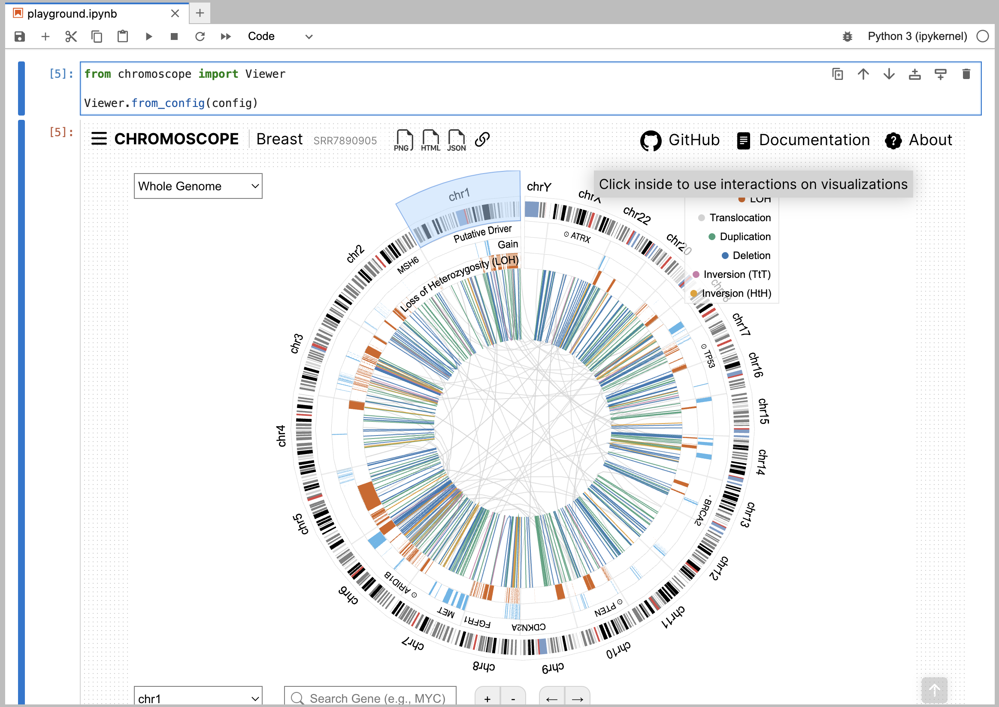

# Using the Python Package

You can use a [Chromoscope Python package](https://pypi.org/project/chromoscope/) to visualize your local SV files directly on computational notebooks, such as [Jupyter Notebook](https://jupyter.org/), [Jupyter Lab](https://jupyter.org/), and [Google Colab](https://colab.research.google.com/).

## Installation

You can install the Python package using `pip` on your terminal.

```sh
pip install chromoscope
```

## Open Jupyter Lab

```sh
jupyter lab
```

We here use Jupyter Lab as an example, but you can also use [Jupyter Notebook](https://jupyter.org/) or [Goolge Colab](https://colab.research.google.com/).

## Setup Data Config

In the Data Config, you can specify either a URL to a remote file or a path to the local file on your computer.

```py
!wget https://somatic-browser-test.s3.amazonaws.com/SVTYPE_SV_test_tumor_normal_with_panel.bedpe

config = [{
    "id": "SRR7890905",
    "cancer": "breast",
    "assembly": "hg38",
    "sv": "./SVTYPE_SV_test_tumor_normal_with_panel.bedpe", # path to a local file
    "cnv": "https://gist.githubusercontent.com/sehilyi/6fbceae35756b13472332d6b81b10803/raw/596428a8b0ebc00e7f8cbc52b050db0fbd6e19a5/SRR7890943.ascat.v3.cnv.tsv" # URL to a remote file
}]
```

## Visualize

Using the data config, you can display Chromoscope visualization.

```py
from chromoscope import Viewer

Viewer.from_config(config)
```

||
|---|
|__Figure.__ Using a Chromoscope Python package on Jupyter Lab|

## Resource
- GitHub: https://github.com/hms-dbmi/chromoscope/tree/master/python
- PyPi: https://pypi.org/project/chromoscope/
