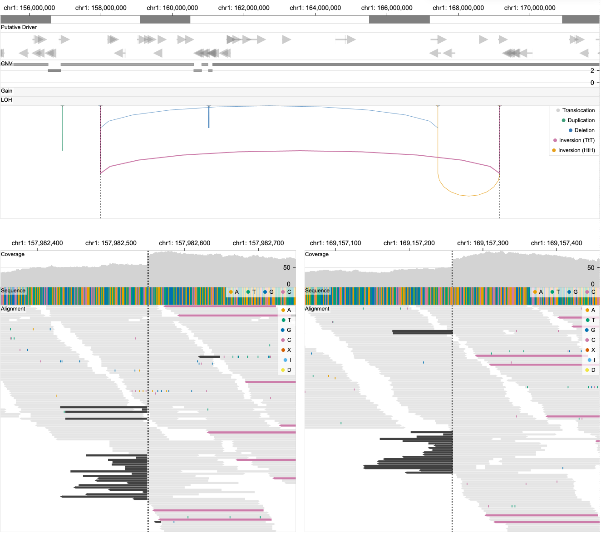

# Breakpoint View
The breakpoint view shows reads around breakpoints and highlights pairs of reads with long distances, showing evidence for structural variant calls.

||
|---|
|**Figure.** Upon clicking on a SV in a linear view (top), a breakpoint view (bottom) appears that shows read alignments around two corresponding breakpoints. Black vertical lines in both views represent the positions of selected breakpoints. |

:::caution
The breakpoing view only shows the sequence track if BAM files are not contained in the selected sample.
:::

:::info
Loading the breakpoint view may take up to few minutes.
:::

## Colors

The five colors (grey, green, blue, pink, yellow) of individual reads represent the types of SV events (translocation, duplication, deletion, tail-to-tail inversion, head-to-head inversion). If a read on the left view has a mate on the right view, these reads are encoded with one of the five colors depending on its SV type. If paired reads are not positioned within the two views, they are just represented in lightgrey. Parts of reads highlighted in different colors represent point mutations (see color legends).

## Interactions

- You can move your mouse on top of a structural variant to see detailed information on a tooltip.