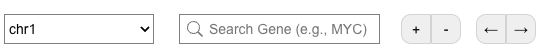

# Navigation

All visualizations in Chromoscope are interactive which is designed to support easy-navigation between genomic regions of interest across scales.

||
|---|
|**Figure.** Additional navigation buttons for selecting a chromosome, searching for a gene, zooming, and panning. |

Users can smoothly zoom and pan, use [an interactive brush](./genome-view), search for a gene of interest, and interactively select a structural variation to instantly display read-level views around breakpoints for an in-depth examination.

||
|---|
|**Figure.** The Header of the Browser. Right next to the sample name, there are multiple types of export buttons. |