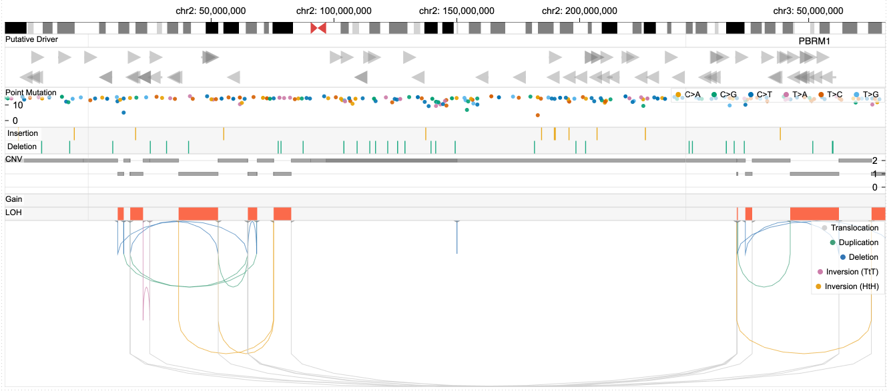

# Variant View
The variant view, focusing on a shorter genomic region, shows additional tracks on top of the tracks included in the genome view, including point mutations, indels, copy number variation, and genes.

||
|---|
|**Figure.** A linear view that shows the region that is selected by an interactive brush of the genome view.|

## Interactions

- You can click on a structural variant of your interest using the mouse. Upon clicking, the browser instantly shows a [breakpoint view](./breakpoint-view) on the bottom that highlights read alignments around the breakpoints.