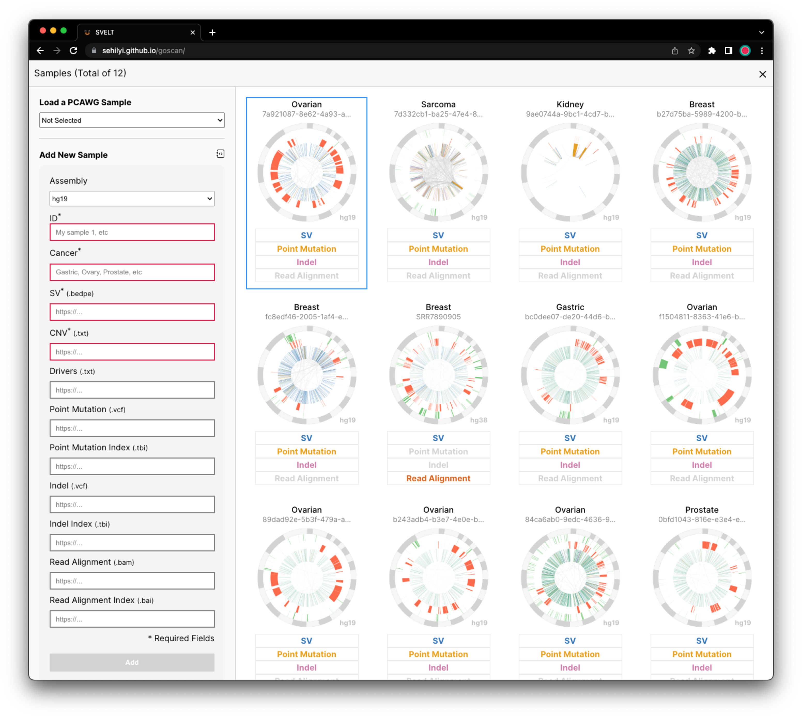
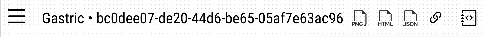

# Visualizations

<!-- ?> 🚧 This page is work in progress 🚧 -->
<!--  -->

Chromoscope offers four main visualizations that enable you to explore structural variants at multiple scales: 
1. [Cohort View](#cohort-view)
1. [Genome View](#genome-view)
1. [Variant View](#variant-view)
1. [Breakpoint View](#breakpoint-view)

|||
|---|---|
|**Figure.** Cohort View|**Figure.** Main Interface|

### Cohort View

This cohort-level view displays structural variants as arches connecting chromosomal breakpoints using distinct colors to indicate duplications, deletions, inversions, and inter-chromosomal translocations. This view also displays copy number variants (CNV) and loss of heterozygosity (LOH).

||
|---|
|__Figure.__ The visual summary of individual samples in the corhot view.

With this cohort overview, you can quickly inspect the patterns of many structural variation samples and efficiently find samples of interest.

?> The four items listed on the bottom of each circular visualization (SV, Point Mutation, Indel, Read Alignment) denote whether the given sample contains the corresponding files.

__Interactions__

- You can click on a sample in this view to analyze them using three visualizations which are in the following sections.
- You can also browse [PCAWG Data](/public-data-config?id=pcawg-data) or [load a small number of your datasets](/data-config?id=loading-data-through-interface).

?> You can find this view by clicking on a ≡ button shown on the top-left corner of the browser.

### Genome View
The genome view shows the selected sample in a circular visualization. This uses the visual representations that are similar to the ones on the [cohort view](#cohort-view) but shows several additional tracks, such as chromosome ideograms and putative drivers.

|||
|---|---|
|**Figure.** Genome View with an interactive brush for selecting a region of interest.|**Figure.** A tooptip showing detailed information.|

__Interactions__

- You can move or resize an interactive brush (light blue) using the mouse. This is linked with a [variant view](#variant-view) that is shown on the bottom of the genome view.
- You can move your mouse on top of a structural variant to see detailed information on a tooltip.

### Variant View
The variant view, focusing on a shorter genomic region, shows additional tracks on top of the tracks included in the genome view, including point mutations, indels, copy number variation, and genes.

||
|---|
|**Figure.** A linear view that shows the region that is selected by an interactive brush of the genome view.|

__Interactions__

- You can click on a structural variant of your interest using the mouse. Upon clicking, the browser instantly shows a [breakpoint view](#breakpoint-view) on the bottom that highlights read alignments around the breakpoints.

### Breakpoint View
The breakpoint view shows reads around breakpoints and highlights pairs of reads with long distances, showing evidence for structural variant calls.

||
|---|
|**Figure.** Upon clicking on a SV in a linear view (top), a breakpoint view (bottom) appears that shows read alignments around two corresponding breakpoints. Black vertical lines in both views represent the positions of selected breakpoints. |

?> Loading the breakpoint view may take up to few minutes.

__Colors__

The five colors (grey, green, blue, pink, yellow) of individual reads represent the types of SV events (translocation, duplication, deletion, tail-to-tail inversion, head-to-head inversion). If a read on the left view has a mate on the right view, these reads are encoded with one of the five colors depending on its SV type. If paired reads are not positioned within the two views, they are just represented in lightgrey. Parts of reads highlighted in different colors represent point mutations (see color legends).

__Interactions__

- You can move your mouse on top of a structural variant to see detailed information on a tooltip.

### Additional Interactions

||
|---|
|**Figure.** The Header of the Browser. Right next to the sample name, there are multiple types of export buttons. |

### Navigation
All visualizations in Chromoscope are interactive which is designed to support easy-navigation between genomic regions of interest across scales.

||
|---|
|**Figure.** Additional navigation buttons for selecting a chromosome, searching for a gene, zooming, and panning. |

Users can smoothly zoom and pan, use [an interactive brush](#genome-view), search for a gene of interest, and interactively select a structural variation to instantly display read-level views around breakpoints for an in-depth examination.

### Export

#### PNG
Chromoscope enables the export of a PNG image file of the entire visualization.

#### HTML
Chromoscope also allows you to export an interactive webpage that contains the entire Chromoscope visualization as a single HTML file.

#### JSON (Gosling Spec)
To enable further fine-grained customization (e.g., changing colors or sizes), the entire interactive visualization can be exported as a Gosling JSON specification. This JSON values can be used directly on the Gosling Online Editor (https://gosling.js.org).

|||
|---|---|
|__Figure.__ The exported HTML file on a browser.|__Figure.__ The exported JSON value added to an public Gosling editor.|

#### Session 🔗
For the effective and efficient communication of findings made with Chromoscope, the tool generates a shareable URL that encodes the current visualization state, including the loaded datahub, selected sample, and genomic locations most recently viewed.

?> To understand the individual parameters of the exported URL, please refer to [our docs](/url-parameters.md).

<!-- #### Navigating Linear Detail View on Circular Overview
By clicking and dragging a mouse on a blue brush, users can navigate a linear view.

#### Opening Alignment Views

Upon clicking on a SV on either an overview or a linear view, two alignment views are opened that show two regions around breakpoints. The selected SV is represented with thicker edges. Vertical gray lines on the alignment views represent the breakpoints of the selected SV.

#### Selecting a Sample

From the sample gallery, a user can select a sample of interest by clicking.

#### Navigating To Specific Chromosomes

Using the drop-down menus, a user can quickly navigate to a certain chromosome on an either overview or the linear detail view.

#### Exporting PNG

#### Interacting with Visualizations
By default, interactions are not activated in visualizations. You will first need to click on a visualization, following the instruction on the top-left corner (i.e., “Click inside to use interactions”). 

After clicking on it, you can now adjust brushes, use the mouse wheel to zoom in and out, and click on a SV. In this mode, you can scroll the entire website by putting your mouse around the main visualization (i.e., gray dotted region). 

When you click on the outside of the visualization, the interactions will be deactivated. In this mode, you can safely scroll the entire website by positioning your mouse anywhere, even on the visualization. -->